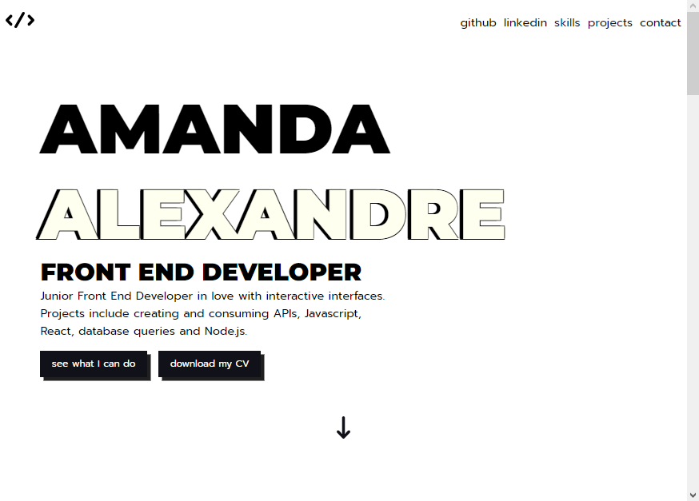

# Amanda Alexandre - Front End Developer

I am a front end developer who is also in love with the data side of things. I'm interested in React and data science.

 - 📈 Big Data Student at Uniasselvi
 - :satellite: Physics Undergraduate Student at Universidade Federal do Maranhão
 - 💼 Business Bachelor at Universidade Estadual do Maranhão

[Click here to see my portfolio](https://amandaalexandre.github.io)

- 🔭 I’m currently working on [Covid API Dashboard](https://github.com/amandaalexandre/covid-countries).
- 🌱 I’m currently learning React, web3 and Data Science.
- 📫 How to reach me: [LinkedIn](https://www.linkedin.com/in/amandavieiradev)
- 😄 Pronouns: she/her

